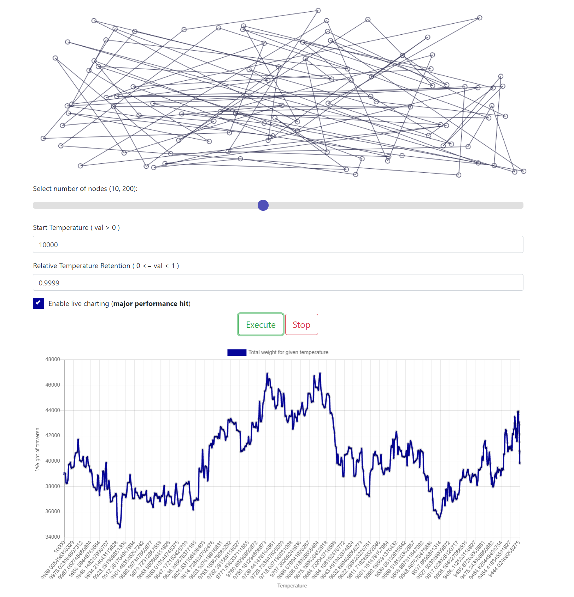

# tsp-simulated-annealing

## About

Simulated annealing approach for the travelling salesman problem.
The temperature and the alpha coefficient can be modified freely from the UI.
The position of the nodes is generated random.

[--> Demo here.](https://bmaris98.github.io/tsp-simulated-annealing/)
